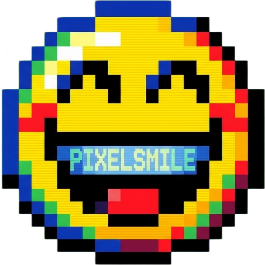
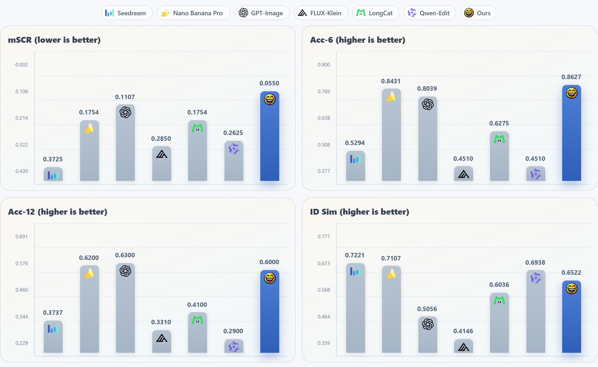
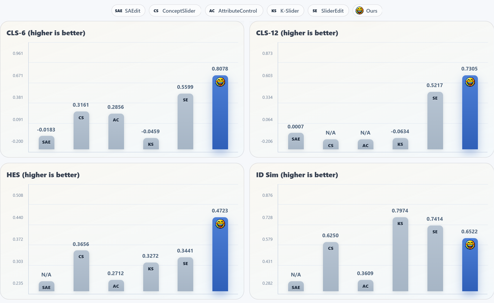

---
language:
- en
license: apache-2.0
task_categories:
- image-to-image
---

<h2 align="center" style="margin-bottom: 0px;">
  <span style="display: inline-flex; align-items: center; gap: 8px;">
    
    <span>FFE-Bench: A Benchmark for Fine-Grained Facial Expression Editing</span>
  </span>
</h2>

<div align="center">
  <a href="https://arxiv.org/abs/2603.25728"></a> &nbsp;&nbsp;&nbsp;&nbsp;
  <a href="https://ammmob.github.io/PixelSmile/"></a> &nbsp;&nbsp;&nbsp;&nbsp;
  <a href="https://github.com/Ammmob/PixelSmile"></a> &nbsp;&nbsp;&nbsp;&nbsp;
  <a href="https://huggingface.co/PixelSmile/PixelSmile"></a> &nbsp;&nbsp;&nbsp;&nbsp;
  <a href="https://huggingface.co/spaces/PixelSmile/PixelSmile-Demo"></a>
</div>

<br>

FFE-Bench was introduced in the paper [PixelSmile: Toward Fine-Grained Facial Expression Editing](https://huggingface.co/papers/2603.25728).

## 📘 Dataset Overview

FFE-Bench is a benchmark for fine-grained facial expression editing across both human and anime portraits, with richer and more diverse expression categories designed to evaluate controllable facial editing in realistic settings.

The current release contains 198 editing tasks in total, including 98 human samples and 100 anime samples. Each sample is defined by an input image, a face bounding box, a target expression category, and a text prompt without intensity modifiers.

## 📏 Evaluation Metrics

The metric definitions follow the [paper](https://huggingface.co/papers/2603.25728).

- `Mean Structural Confusion Rate (mSCR)`: evaluates structural confusion between semantically overlapping expressions.
- `Accuracy (Acc)`: evaluates expression editing accuracy.
- `Control Linearity Score (CLS)`: evaluates linear controllability.
- `Harmonic Editing Score (HES)`: evaluates the overall balance between expression editing quality and identity preservation.
- `Identity Similarity (ID Sim)`: evaluates identity consistency between the source and edited faces.

## 📈 Benchmark Results

We report two complementary benchmark settings:

- `General Editing`: compares general-purpose editing models and facial editing models on structural confusion, editing accuracy, and identity consistency.
- `Linear Control`: compares methods designed for controllable expression manipulation on control linearity, editing quality, and identity preservation.

The current benchmark results include the following models:

- `General Editing`: Seedream-4.5, Nano Banana Pro, GPT-Image-1.5, FLUX.2 Klein, LongCat-Image-Edit, Qwen-Image-Edit-2511, and PixelSmile.
- `Linear Control`: SAEdit, ConceptSlider, AttributeControl, Kontinuous-Kontext, SliderEdit, and PixelSmile.

<p align="center">
  
</p>

<p align="center">
  
</p>

## 📊 Evaluation Code

The evaluation code will be released soon at the [GitHub repository](https://github.com/Ammmob/PixelSmile).

## 📖 Citation

If you find FFE-Bench useful in your research or applications, please consider citing our work.

```bibtex
@article{hua2026pixelsmile,
  title={PixelSmile: Toward Fine-Grained Facial Expression Editing},
  author={Hua, Jiabin and Xu, Hengyuan and Li, Aojie and Cheng, Wei and Yu, Gang and Ma, Xingjun and Jiang, Yu-Gang},
  journal={arXiv preprint arXiv:2603.25728},
  year={2026}
}
```