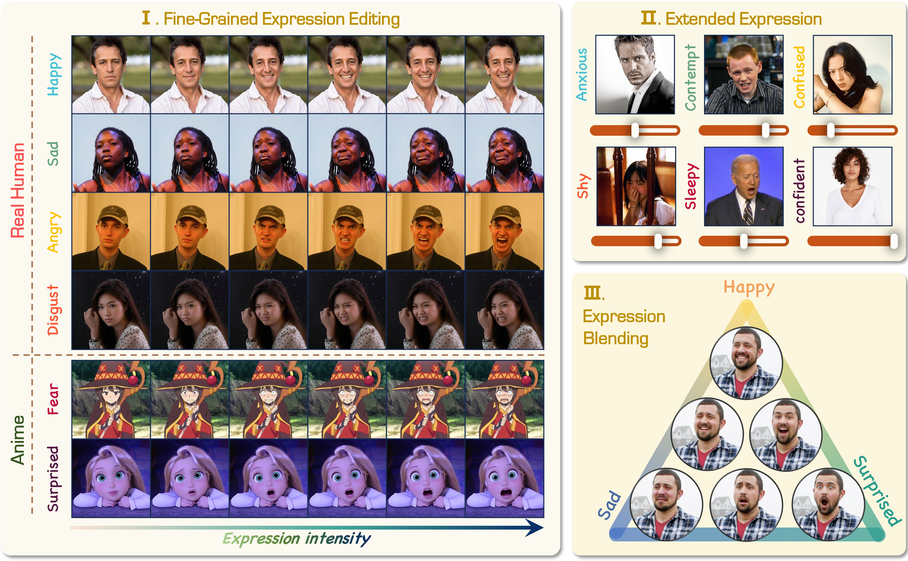

<!-- <div align="center"> -->
  <h2 align="center">
    
    PixelSmile: Toward Fine-Grained Facial Expression Editing
  </h2>
<!-- </div> -->

<div align="center">
  <a href="#" title="Coming soon"></a> &nbsp;&nbsp;&nbsp;&nbsp;
  <a href="https://ammmob.github.io/PixelSmile/"></a> &nbsp;&nbsp;&nbsp;&nbsp;
  <a href="https://huggingface.co/PixelSmile/PixelSmile"></a> &nbsp;&nbsp;&nbsp;&nbsp;
  <a href="#" title="Coming soon"></a> &nbsp;&nbsp;&nbsp;&nbsp;
  <a href="#" title="Coming soon"></a>
</div>


<p align="center">
  
</p>

## 📢 Updates

- [03/25/2026] 🔥 [Inference Code](https://github.com/Ammmob/PixelSmile) is released.
- [03/24/2026] 🔥 [Project Page](https://ammmob.github.io/PixelSmile/) and [Model Weight (preview)](https://huggingface.co/PixelSmile/PixelSmile/blob/main/PixelSmile-preview.safetensors) are released.

## 🚀 Release Plan

- [x] Project Page
- [x] Model Weight (preview)
- [ ] FFE-Bench
- [x] Inference Code
- [ ] Training Code
- [ ] Online Demo
- [ ] Model Weight (Stable)

## ⚡ Quick Start

Quick start for PixelSmile inference.

1. Install the environment in [Installation](#-installation).
2. Download the base model and PixelSmile weights in [Model Download](#-model-download).
3. Run inference in [Inference](#-inference).

## 🔧 Installation

### For Inference

Create and activate a clean conda environment:

```bash
conda create -n pixelsmile python=3.10
conda activate pixelsmile
```

Install the inference dependencies:

```bash
pip install -r requirements.txt
```

Patch the current `diffusers` installation for the Qwen image edit bug:

```bash
bash scripts/patch_qwen_diffusers.sh
```

### For Training

If you want to train PixelSmile, install the additional training dependencies on top of the inference environment:

```bash
pip install -r requirements-train.txt
```

## 🤗 Model Download

### For Inference

PixelSmile uses [Qwen/Qwen-Image-Edit-2511](https://huggingface.co/Qwen/Qwen-Image-Edit-2511) as the base model.

| Model | Stage | Data Type | Download |
|-|-|-|-|
| PixelSmile-preview | Preview | Human | [Hugging Face](https://huggingface.co/PixelSmile/PixelSmile/blob/main/PixelSmile-preview.safetensors) |

### For Training

Training requires additional pretrained weights and auxiliary models.
We will provide the full training asset list soon.

## 🎨 Inference

PixelSmile supports two simple ways to run inference.

### Option 1. Edit the default arguments in the script

```bash
cd PixelSmile
bash scripts/run_infer.sh
```

You can edit [scripts/run_infer.sh](/data/workspace/qwen-image-edit-sft/code/scripts/run_infer.sh) and directly modify the default values in `DEFAULT_ARGS`.

### Option 2. Pass arguments from the command line

```bash
cd PixelSmile
bash scripts/run_infer.sh \
  --image-path /path/to/input.jpg \
  --output-dir /path/to/output \
  --model-path /path/to/Qwen-Image-Edit-2511 \
  --lora-path /path/to/PixelSmile.safetensors \
  --expression happy \
  --scales 0 0.5 1.0 1.5 \
  --seed 42
```

Command-line arguments will override the default values in the script.

## 🧠 Training

Training code is coming soon.

## 📖 Citation

If you find PixelSmile useful in your research or applications, please consider citing our work. The BibTeX entry will be released soon.
